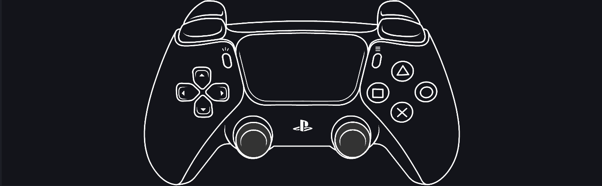

# Mugen Gamepad Overlay 0.8.0

Локальный нативный источник отображения геймпада для OBS Studio под Windows.

Mugen Gamepad Overlay получает ввод через SDL3 и отрисовывает его прямо внутри OBS Studio. Для работы не нужны браузерный источник, сайт, WebSocket-сервер или передача ввода через интернет.

## Основные возможности

- встроенный универсальный технический скин для быстрой проверки;
- локальные пресеты Input Overlay 5.x `JSON + PNG`;
- локальные скины GamepadViewer `CSS + SVG/PNG/JPEG` без браузера и JavaScript;
- стики, L3/R3, крестовина, плечи, аналоговые триггеры, Guide/Home, Capture/Misc и щелчок тачпада, когда контроллер их предоставляет;
- автоматические или ручные обозначения Xbox, PlayStation и Nintendo;
- живое обновление списка при подключении и отключении контроллеров;
- расширенное переназначение кнопок и источников триггеров через SDL и Raw button/hat/axis;
- понятные двуязычные плашки ошибок при отсутствии или повреждении файлов скина;
- хоткей включения и выключения отдельного источника.

## Установка

### Установщик — рекомендуется

1. Полностью закройте OBS Studio.
2. Запустите `Mugen-Gamepad-Overlay-0.8.0-Windows-x64-Setup.exe`.
3. Запустите OBS Studio и добавьте источник **Mugen Gamepad Overlay**.

Установщик использует рекомендуемую общую папку плагинов:

`C:\ProgramData\obs-studio\plugins\mugen-gamepad-overlay`

### Ручные ZIP-архивы

Для обычной установки предназначен стандартный ZIP, для portable или нестандартной папки OBS — отдельный portable ZIP. Точные пути и удаление описаны в [INSTALL-RU.md](INSTALL-RU.md).

## Источники скинов

Сторонние скины в архив не входят.

- GamepadViewer: вручную проверена коллекция `frolovlife/gamepadviewer-skins`.
- Input Overlay: проверены игровые пресеты Input Overlay 5.0.5.

Импортированная графика сохраняет собственные подписи и лицензии. Выбор обозначений в плагине меняет только встроенный скин и интерфейс переназначения.

## Определение контроллеров

Автоматические подписи используют тип и раскладку, которые Windows и SDL сообщили плагину. Они могут отличаться от надписей на физическом корпусе из-за Bluetooth/XInput/DInput-режима, драйвера, Steam Input, DS4Windows, адаптера или виртуального контроллера.

На реальных устройствах проверены DualSense, Xbox-совместимые контроллеры, Flydigi Vader 2 Pro через USB и приёмник, 8BitDo M30 в нескольких режимах, SVEN X-PAD и Flipper Zero в режиме USB Game Controller. Специализированные Raw Joystick/HOTAS не входят в область 0.8.0.

Подробности: [docs/CONTROLLER-DETECTION-RU.md](docs/CONTROLLER-DETECTION-RU.md).

## Известные ограничения

- в 0.8.0 выпускается только Windows x64;
- Raw SDL Joystick/HOTAS не поддерживаются, если SDL не представляет устройство как Gamepad;
- произвольный браузерный CSS, JavaScript, HTML, удалённые ресурсы и CSS-анимации не гарантируются;
- старые Input Overlay INI и RetroArch CFG не поддерживаются;
- возможен физический щелчок тачпада, но не координаты касаний и жесты.

## Конфиденциальность

Плагин считывает ввод локально. В нём нет телеметрии, рекламы, браузерного движка и сетевых запросов.

## Раскрытие использования ИИ

Mugen Gamepad Overlay разработан Mugen Art Lab при существенной помощи OpenAI ChatGPT в генерации кода, отладке, документации и подготовке релизных инструментов. Направление проекта, выбор функций, тестирование на реальных устройствах, визуальная оценка, проверка и ответственность за релиз остаются за Mugen Art Lab.

Подробнее: [AI-DISCLOSURE.md](AI-DISCLOSURE.md).

## Ошибки и поддержка

Воспроизводимые ошибки можно сообщать через Issues:

https://github.com/Mugen-Art-Lab/Mugen-Gamepad-Overlay/issues

Mugen Gamepad Overlay бесплатен и имеет открытый исходный код. Ссылки на необязательную поддержку размещены в профиле Mugen Art Lab:

https://github.com/Mugen-Art-Lab

## Лицензия

GPL-2.0-or-later. См. [LICENSE](LICENSE) и [data/THIRD-PARTY-NOTICES.txt](data/THIRD-PARTY-NOTICES.txt).

Mugen Gamepad Overlay — независимый сторонний плагин, не связанный с OBS Project и не одобренный им.
