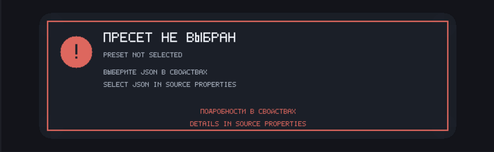

# GamepadViewer custom-skin compatibility

[Русская версия](GAMEPADVIEWER-COMPATIBILITY-RU.md)

Mugen Gamepad Overlay does not load the GamepadViewer website and is not a browser. It reads local CSS as layer data, loads local SVG/PNG/JPEG assets, and renders them through its own native OBS renderer.

## Preparing a skin

Download the complete skin folder and preserve relative paths. Then choose:

```text
Skin source → Local GamepadViewer skin (CSS)
Local CSS skin file → the required .css file
```

The [`frolovlife/gamepadviewer-skins`](https://github.com/frolovlife/gamepadviewer-skins) collection was manually tested.

## Supported controls

The renderer recognizes common GamepadViewer classes for face buttons, Start/Back, Guide/Home/Capture/Misc/Touchpad, shoulders, analog and digital trigger layers, moving sticks with L3/R3 pressed states, D-pad directions, and common arcade-stick direction layers.

## Supported CSS subset

The native parser supports the common positioning and sprite-sheet features used by the tested collection, including local image URLs, dimensions and offsets, percentages, `vw`/`vh`, simple `calc(...)`, background position and size, opacity, hiding, pressed-state selectors, horizontal reflection, and a limited set of safe pseudo-elements and color filters.

## Intentional limits

- JavaScript and HTML are not executed.
- Network URLs and paths outside the selected skin folder are rejected.
- CSS animation and the complete browser CSS model are not supported.
- Embedded Base64 raster data inside SVG is not guaranteed.
- A custom skin may rely on browser behavior outside the safe local subset.

When a skin cannot be loaded, the plugin displays `SKIN NOT LOADED`; the detailed reason is shown in source properties and written to the OBS log.


